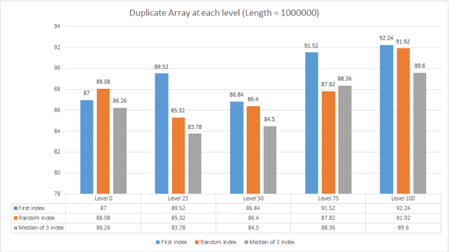

# Program Runtime Analyzer By Randomization

## Overview

Have this ever happened to you? When doing Competitive Programming, you come up with 2 approaches even in the same Big O notation but don't know which one is better? Here comes Program Runtime Analyzer! This program will analyze your runtime through randomization by millisecond to conclude which algorithms is actually better.

That's actually how I built this program. Because sometimes, I wanted to test out different algorithms in Codeforces, rather than just
know that whether my submission is approved or not.

**This is the result of my program analyzer**



The program can: 
- Generate differnet submissions
- Print the running time of all methods 

## Usage

For example, I will analyze 3 types of choosing pivots in Sort: Random, Median, and First Index

To use the CountrySorterLost program, run the following commands after downloading the code:
```
$ javac *.java
$ java Quicksort
```

The program will display the list of task then ask for the task user want:
```
[1]: Random; [2]: Duplicate; [3]: Sorted
[4]: All three
Enter task you want to do
```
For example, if you ask for task 1, it will print the result of the Random array

```
User task is: 1
Length of the array: 10000
RANDOM ARRAY:
First index: 0.66
Random index: 0.62
Median of 3 index: 0.54
```


### Median of 3 pivot selector

Our program can get the index of median of 3 pivot selector implemented correctly. Here is a snippet of code:
```java
public int choosePivotIndex(int[] array, int first, int last) {
        int firstItem = array[first];
        int lastItem = array[last];
        int mid = (first+last)/2;
        int midItem = array[mid];
        if (firstItem >= Math.min(midItem, lastItem) && firstItem <= Math.max(midItem, lastItem))
        {
            return first;
        }

        else if (midItem >= Math.min(firstItem, lastItem) && midItem <= Math.max(firstItem, lastItem)) {
            return mid;
        }

        else {
            return last;
        }
    }

```

### Contact: https://www.linkedin.com/in/duyngp/
